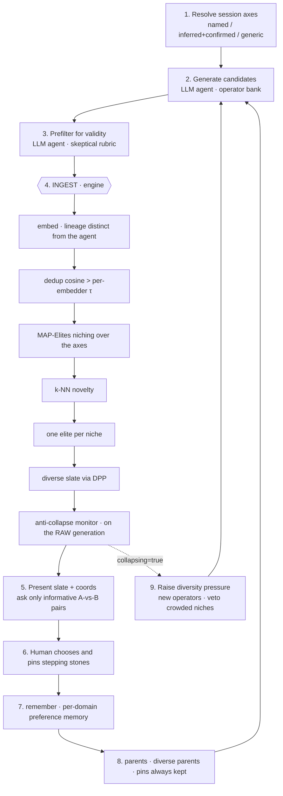

# A reference architecture for amplifying human creativity: variation by an LLM agent, geometric diversity, and human selection

**Sergi Parpal**
Code: <https://github.com/sergiparpal/creativity-amplifier> · License: MIT

---

## Abstract

We present a reference architecture, implemented and verifiable, for amplifying human creativity when the value of an idea is **subjective**: the case, common in open-ended domains, where no cheap oracle decides which idea is good and the bottleneck is not generating variants —something an LLM already does at superhuman scale— but recognizing which ones are worth keeping. The design principle is to split three distinct signals across three components. Geometry (embeddings, MAP-Elites niching, k-NN novelty, DPP selection) decides what is *new*; the judge —an LLM agent— decides only what is *valid* and ranks *within* a niche; and the human reserves the *value* judgment exclusively, queried by active learning only at the points of maximum information. Diversity, therefore, is set by geometry and never by the judge. The system ships as a Claude Code *plugin* with a single model-invoked *skill* plus a server-less, deterministic diversity engine in Python —no extra API key— that communicate through a JSON contract. An anti-collapse monitor that is structurally impossible to bypass watches the LLM's tendency to converge toward the typical response, and an executable *self-test* acts as a correctness contract: it requires the diverse slate to beat a single-shot baseline and an induced collapse to reverse. We report the results of that *self-test* and discuss, without caricaturing the comparison, which pathologies the architecture mitigates and which it leaves open.

---

## 1. Introduction

It is useful to think of idea creation as a two-stroke engine —**generate variants and select the ones that work**— in which the meaning of an idea is assigned in the evaluation phase, not before the variant is generated. This separation between blind variation (structured by knowledge, but without knowing in advance which variant will succeed) and selective retention has a long tradition, from Campbell and Simonton [1, 2] to the *Geneplore* model of Finke, Ward, and Smith [3]. Three observations follow from it that we take as design premises.

First: **the bottleneck is not variation, but the selection of value.** An LLM generates variants at a scale, speed, and coverage no human matches; where the system falls short is not in generating ideas, but in recognizing which ones are worth keeping.

Second: **an LLM tends to converge toward the typical.** It is trained to predict the next probable token and aligned to be agreeable —two pressures that push the output toward the modal response, exactly the opposite of what creativity demands. Without an explicit defense, an LLM-driven search collapses toward the mean.

Third: **the value a human assigns to an idea is largely tacit.** One recognizes that an idea is good before being able to articulate why [16]; it is also contextual and shifting. We have no theory that would let us write the evaluation function, so the human reappears again and again as the anchor of value.

From this follows the stance of this work: not to build an autonomous creative machine, but an **amplifier** that turns scarce human judgment into a wide, well-explored search, honest about what it cannot automate. The difficulty depends on whether an oracle exists that measures value. When one does —tests that pass or fail, a formal proof, a computable property— that verifier *is* the fitness function and the system can operate almost autonomously. When value is **subjective**, there is no such oracle: someone has to supply the missing judgment, and that someone is the human. The engineering challenge then becomes spending their attention —scarce and slow— as cost-effectively as possible.

This system addresses that by splitting the work according to where each signal naturally resides. **Breadth** —covering a large idea space without repetition— is entrusted to the **geometry of the idea space**: a signal that comes neither from the judge nor from the lineage that generated the ideas, and that, being purely geometric, cannot be gamed the way a learned diversity metric could. The **judge** LLM handles only a narrow role —validity and within-niche ranking, plus a *bounded, low-weight* nudge to the slate ordering (quality-weighted diversity, clipped so it can never prune variety or collapse diversity)— and never picks the final slate. **Value** stays whole in the human, spent with surgical precision. The contribution is therefore less a new algorithm than an **architectural decision with verifiable consequences**: which component owns which signal, and why that split defends against collapse toward the typical.

---

## 2. Positioning and related work

The system inherits from three lineages that here meet in a single loop.

**Blind variation and selective retention.** The split of the engine into generation (blind but biased by knowledge) and retrospective selection comes from Campbell and its development by Simonton [1, 2], and converges with the *Geneplore* model of Finke, Ward, and Smith [3], which distinguishes a generative phase of preinventive structures from an exploratory phase that assigns them meaning. The typology of creative operations —combinational, exploratory, transformational— is Boden's [4]. The most fertile operator, analogy, rests on Gentner's structure-mapping [5] and the conceptual integration of Fauconnier and Turner [6].

**Quality-Diversity and novelty search.** The retention machinery is a MAP-Elites archive [7] that keeps one elite per niche instead of a single best, indexed by descriptor axes. The deeper motivation is the *deceptiveness of the objective* of Lehman and Stanley [8]: a search guided purely by the objective razes the *stepping stones* that lead to the best solutions; novelty search preserves them. The Quality-Diversity paradigm of Mouret, Clune, and Cully [7, 9] formalizes keeping what is good-and-distinct. For the open axis we use a CVT tessellation in the style of Vassiliades et al. [10]. The way the human "pins" interesting ideas to keep exploring from them is that of Picbreeder [11].

**Diverse selection and metrics.** The final slate is chosen with a Determinantal Point Process (DPP) [12], which favors mutually dissimilar subsets; we use the fast greedy MAP inference of Chen et al. [13]. Diversity is quantified, among other ways, with the *Vendi score* of Friedman and Dieng [14], the effective number of distinct items.

Against these lineages, the engineering novelty of this work lies in none of the pieces taken separately —all are known— but in **the contract that joins them**: an LLM agent that generates and judges validity, a geometric engine that owns diversity, and a human that owns value, with the invariant that diversity never passes through the judge. The self-rewriting meta-level in the style of Promptbreeder [15] remains future work and is discussed as such.

---

## 3. Architecture overview

The system splits into two halves that meet at a JSON contract.

The **LLM half** is prose: a `SKILL.md` file and a set of references (`loop.md`, `operators.md`, `judge_rubric.md`, `axis_inference.md`) that are *instructions for a future instance of the agent*. That instance is the generation engine and the validity judge. There is no extra chat API key: the very agent that runs the *skill* generates the variants and applies the prefilter.

The **engine half** is a deterministic Python CLI —pure, JSON in / JSON out, no LLM calls. It owns all the anti-convergence math. It runs locally on CPU.

The invariant that governs the whole system, and that any change must preserve, is a single one:

> **Diversity is owned by geometry; the judge owns only validity.** Geometry (the engine) owns *novelty*: embeddings, MAP-Elites niching, k-NN novelty, DPP selection. The LLM (the agent) owns only *validity* and *within-niche ranking*: it filters what is off-brief and may assign a `fitness` ∈ [0,1] that ranks *within* a niche. That fitness is also given a *bounded, low-weight* say in the DPP slate (affine-rescaled and clipped to a [0.7, 1.3] multiplier, blended at weight 0.3), so it can nudge ordering but never prune variety, collapse diversity, or pick the final slate. The human is the real selector.

One session cycle, described in `loop.md`, chains nine steps:

The split of signals by component is the axis of the design: the **framing** (the axes) is set by the human and configures the whole search; **variation** is produced by the agent with the operator bank; **diversity** is owned by the engine; **validity** is judged by the agent; **value** is owned by the human.

---

## 4. The diversity engine

The heart of the system is the `ingest` command, which runs a chain of seven stages. All embeddings are L2-normalized rows, so cosine similarity is a dot product.

**Embedding with a distinct lineage.** The survivors of the prefilter are embedded with a model deliberately from **another lineage** than the agent: the multilingual static model `minishlab/potion-multilingual-128M` (model2vec, 256-dim, 101 languages, numpy-only inference) on CPU by default, with the English-only `BAAI/bge-small-en-v1.5` available as a higher-fidelity opt-in. The choice is intentional: "what is novel" should not be judged by the same lineage that generated the ideas — and a multilingual default keeps that hedge intact across languages. A deterministic hash embedder (no downloads) serves the tests and the offline *self-test*; an API embedder is left as a planned connector.

**Deduplication.** Greedy near-duplicate removal: a row is dropped if its cosine similarity to any already-kept row (or to the archive's existing elites) exceeds a **per-embedder threshold** τ — 0.92 for the hash fixture, 0.93 for the static `potion` default, and 0.94 for the semantic `bge` model, calibrated per family because their cosine scales differ. This avoids wasting niches on trivial rephrasings without touching real variety.

**MAP-Elites niching.** Each candidate is placed into a **niche**, a discrete cell of descriptor space formed by combining one *bucket* per axis:

- `categorical` axis → the value itself (normalized);
- `continuous` axis → the *bin* index over its range (5 bins by default);
- `open` axis → a frozen Voronoi cell over the *embedding* of the axis value.

For the open axis —the main carrier of novelty— a `CVTNicher` provides a **data-adaptive, fit-once-then-freeze** partition: early cycles assign against deterministic cold-start centroids (random unit directions fixed by the seed), and once `OPEN_NICHE_FREEZE_FACTOR × OPEN_NICHES` (= 48) mechanism embeddings have accumulated, *k*-means is fit **once** (`random_state = seed`), the centroids are persisted, and the existing archive is re-keyed onto them (merging any collapsed niches by the elite rule). It never refits afterward, so cell ids stay stable across cycles; assignment is by maximum cosine similarity. Exactly one axis may be marked `primary_novelty`. The archive keeps **at most one elite per niche**; within a niche the higher `fitness` wins (fitness coming from the judge), and ties break toward higher geometric novelty. The judge is never invoked here: geometry owns diversity and quality only ranks within an already-diverse niche.

*A scoping note on what geometry owns.* Niche **placement** —on every axis, not only the open one— is computed from the agent's `descriptor` text: a differently-worded `mechanism`, or a categorical mislabel, lands an idea in a different cell and so changes the elite competition and the DPP pool. The open axis is not special in this respect. The purity guarantee the design makes is narrower and exact: **k-NN novelty, deduplication, and the DPP kernel are all computed on the idea-text embedding** produced by the lineage-distinct embedder. So even where the agent's words steer placement, they are passed through an *independent* geometry; what the agent influences is its own word choice, never the generator's similarity judgment. (One could, for stricter purity, niche the open axis on the full idea-text embedding rather than the descriptor; the descriptor is kept deliberately, as the focused "core how" that gives the mechanism axis its intended meaning.)

**Geometric novelty.** The novelty of each survivor is the mean cosine distance to its *k* = 5 nearest neighbors within (existing elites ∪ other survivors). It is a pure property of where the point falls relative to others: far from its neighbors it is novel, in a crowd it is not. It is the only thing that decides "is this new?".

**Diverse slate via DPP.** Over the current elites a PSD kernel `L = diag(q)·(XXᵀ)·diag(q) + jitter·I` is built, where `XXᵀ` is the Gram matrix (always PSD) and `q` weights by quality to balance diversity against per-item quality. Because the kernel uses `q` multiplicatively, an unbounded fitness could swamp the diversity term; so `q` is **bounded** before use — the observed fitness range is affine-rescaled to `[0.7, 1.3]` and damped toward uniform by a quality-diversity weight (default 0.3), then clipped. Uniform fitness collapses to all-ones, i.e. pure diversity. The slate is obtained with fast greedy MAP inference for the DPP [13], maximizing the marginal gain in log-determinant —geometrically, the volume the subset spans— with a fallback to *farthest-point sampling* if anything degenerates. The default slate size is 6; the *pool* is capped at 200 elites for latency, prioritized by novelty.

**Anti-collapse monitor.** Two complementary signals decide whether the search is converging: the **normalized Shannon entropy** over niche occupancy (are the ideas spreading across many niches or piling into a few?) and the **mean pairwise cosine** of the generation (are the raw candidates becoming alike?). The similarity signal is **calibrated to the project**: a rolling window of recent generations' mean cosine forms a baseline, and the `collapsing` flag fires when a generation exceeds `baseline + margin` (0.15) or an absolute safety ceiling (0.80); before the window has at least two samples it falls back to a fixed absolute threshold (0.55). Once calibrated, the window is trained only on *healthy* generations — those the relative rule does not flag — so a sustained collapse cannot raise the baseline above itself and silence the alarm; while bootstrapping, every generation is admitted so the baseline can form even under an embedder whose cosine scale trips the absolute fallback. It also fires if the normalized entropy falls below 0.50 with at least three occupied niches. This keeps the monitor from misfiring when a different embedder or domain shifts the natural scale of cosine similarity. A deliberate subtlety: the monitor runs on the **raw vectors before deduplication**, so a near-duplicate batch registers as a collapse instead of hiding behind the survivors. The monitor only *reports*; the *skill* reacts by raising diversity pressure —unused operators, veto on saturated niches, demand distance from the recent set. The machinery is never removed or worked around: it is the point of the tool.

---

## 5. The human in the loop

A single principle governs all use of the human: **minimize queries while maximizing their information value**. It is realized at four leverage points.

**The framing (the axes).** The first and largest leverage point. "Domain-agnostic" does not eliminate the need for descriptor axes; it resolves them per session with a cascade: if the user names a domain with a template, it is loaded; otherwise the agent **infers 4–6 axes** from the brief —marking exactly one as `open`/`primary_novelty`— and **confirms them with a single question**; if it cannot, it falls back to the neutral generic axes. A single decision configures the whole search: cheap in attention, enormous in effect. Nothing about a domain is baked into the plugin.

**Active learning: which pairs to ask.** From the slate, at most two A-vs-B pairs are chosen by their **informativeness**, scored as `0.5·similarity + 0.3·uncertainty + 0.2·novelty`, skipping pairs the user already resolved. That is: it asks about pairs that are **similar** in embedding (a fine distinction the model cannot resolve → maximum judge disagreement), of **uncertain** quality (close fitness), and on the **novel frontier**. Each idea's niche coordinates are shown alongside it, because embedding diversity does not always coincide with the distinctness a human perceives, and it is best to let the human judge.

The dominant **similarity** weight encodes a specific reading of the question's purpose: if the goal is to **learn the preference function** (rank within niches, choose parents), comparing near-identical ideas is exactly the boundary of maximum judge disagreement and is the right thing to ask. Under a competing reading —if the goal were **exploration**— comparing near-twins is the *least* useful question and one would prefer region-separating pairs. The architecture does not adjudicate between the two (the value-gate does not test the pair policy), so rather than hard-code one it makes the three weights tunable per domain (`engine.ask_sim_weight`, `…uncertainty_weight`, `…novelty_weight`); a non-positive similarity weight flips the policy from learn-preference to explore. The defaults reproduce the learn-preference behavior.

**Stepping stones.** The user can **pin** any idea as a stepping stone to keep exploring from. Pins are never discarded, not even if there are more pins than the parent quota. This implements the Picbreeder mode: preserving the stepping stones that a purely objective-driven search would raze.

**Preference memory and parents.** Comparisons and pins are stored in local memory **namespaced per domain**, and summarized for injection into context the following session (win counts, preferred descriptor values). For the next generation, `parents` returns diverse parents by *farthest-point* from the pins, biasing toward fertile but distinct regions.

It is worth naming honestly the limit of this half: the preference memory is **heuristic** —tallies and preferred values— not a calibrated value *proxy* that scores the bulk of candidates. The system amplifies the human's *reach* (via geometry) and records their choices, but it still **does not amplify their value judgment** across many candidates the way a trained proxy would. We return to this under limitations.

---

## 6. Correctness guarantees

The system treats the correctness of its diversity guarantees as an executable contract, not a prose promise. The `selftest` command runs the full loop with a stubbed LLM and a stubbed human and checks two things.

**Value gate.** The engine's diverse slate must beat a **single-shot** baseline —a brief resolved in the clichéd way, with little variation— on mean pairwise distance, *Vendi score*, and niche entropy. In addition, and crucially to isolate the engine's contribution from the generator's, the DPP must beat **naive first-N selection over the same *pool*** of candidates. To keep that second comparison honest it is **de-rigged**: the pool is *shuffled* (so first-N is a random slice, not trivially the leading near-clones) and the win is *averaged over several seeds*; and a **null check** confirms DPP does not regress below a random subset on an already-uniform pool, where there is nothing for selection to gain. The first proves the loop delivers diversity; the second, that geometric **selection** adds value on its own, with the generator held fixed.

**Induced-collapse reversal.** A deliberately uniform generation (similar but not duplicated: above the monitor's threshold, below the dedup threshold) must trip the `collapsing` flag; and the next generation, once diversity pressure is raised, must recover.

To these are added three structural guarantees that are not tests but properties of the design: the **lineage bias** is covered by using an embedding lineage distinct from the agent's; **determinism** is preserved by passing the same seed to niching, DPP, and CVT throughout a session; and the **monitor is never bypassed**. A `selftest` failure is treated as a real regression in the diversity guarantees.

---

## 7. Evaluation

We report the `selftest` run with the deterministic hash embedder —a lexical, reproducible, download-free fixture— and the test suite. The figures should be read as evidence that the **mechanism** works and that DPP **selection** contributes independently of the generator; absolute values with a semantic embedder (the default `potion` static model, or the opt-in `bge-small`) would differ, but the fixture isolates the architecture's effect from model noise.

**Value gate — engine vs single-shot:**

| Metric | Engine (slate) | Single-shot | Reading |
| :-- | --: | --: | :-- |
| Mean pairwise distance | **0.664** | 0.122 | ↑ ≈ 5.4× |
| Vendi score | **4.82** | 1.60 | ↑ ≈ 3.0× |
| Niche entropy | **1.79** | 0.00 | from 1 to several niches |
| Coverage (niches) | **6** | 1 | — |

**Isolating selection — DPP vs first-N over the same *pool*:** the pool is *shuffled* and the win is *averaged over several seeds*, so first-N is a random slice rather than the leading near-clones (a de-rigged, non-tautological comparison).

| Metric | DPP | First-N | Reading |
| :-- | --: | --: | :-- |
| Mean pairwise distance (avg) | **0.731** | 0.642 | ↑ — DPP wins a genuinely random first-N |
| Vendi score | **5.11** | 4.34 | ↑ |
| Coverage (niches) | **6** | 5 | — |

That DPP beats first-N over the *same set of candidates* — even when first-N is a random draw, not the rigged leading clones — is the result that matters: the gain comes not from generating better, but from **selecting** geometrically. A companion *null check* confirms DPP does not regress below a random subset on an already-uniform pool.

**Induced-collapse reversal** (after warming the monitor's rolling baseline with two diverse generations, so the *calibrated relative* rule drives the decision):

| State | `collapsing` | Mean cosine | Norm. entropy | Coverage |
| :-- | :--: | --: | --: | --: |
| Uniform generation | **yes** (0.83 > 0.54 = baseline 0.39 + margin) | 0.832 | 0.915 | 25 |
| After raising diversity | **no** (0.39 < 0.69 limit) | 0.388 | 0.940 | 35 |

The collapse is detected — by the *relative* baseline+margin rule, not a fixed constant — and reversed: the mean cosine drops from 0.83 to 0.39. (Normalized entropy stays high throughout here because the baseline warm-up has already spread occupancy across niches; the similarity signal is what trips and clears.) Under the live `bge` embedder the same reversal holds (collapse 0.88 > 0.80, recovery 0.70 quiet), where the old fixed 0.55 threshold would have misfired — the calibration's reason for being.

**Suite and size.** The suite runs **109 tests** (unit, property, and end-to-end) green, hermetically (hash embedder and isolated state, no downloads). The engine is ~3,100 lines of Python; the tests, ~1,400. The value gate and the collapse reversal both pass, offline and `--live`.

---

## 8. Discussion: which pathologies the architecture mitigates

It is worth mapping the design onto the pathologies specific to an LLM-driven creative search when value is subjective.

**Collapse toward the typical.** This is the central pathology, and here it receives a *structural* defense, not an exhortatory one. The MAP-Elites archive keeps one elite per niche instead of a single best; the DPP picks by spanned volume; k-NN novelty rewards far-flung points; and the monitor raises pressure when diversity drops. None of these mechanisms passes through the low-perplexity judge that tends toward the modal response. Diversity is not something the system must *remember* to want: it is the geometry of its loop.

**Goodhart and reward hacking.** When diversity is measured by a learned metric, a system can end up maximizing the metric instead of real diversity. Here that risk does not arise for diversity: it is geometric and foreign to the judge, so there is no learned diversity metric that can be *gamed*. The price —that the system does not amplify value across many candidates, because it does not learn a value *proxy* either— is discussed as a limitation.

**Anchored value.** The system does not attempt to formalize subjective value; it replaces it with a good allocation of the human's attention, the human being the one with something at stake. The human enters at the framing, at the informative pairs, and at the pins, and only there. It is the engineering answer to the fact that human value is tacit knowledge.

**Deceptiveness of the objective.** Pins preserve *stepping stones* that an objective-driven search would discard for not looking immediately promising, and the diverse parents seed from them. It is the direct translation of Lehman and Stanley's novelty search into the human-in-the-loop setting.

---

## 9. Limitations

An honest accounting must name what this architecture does **not** solve.

**No learned value proxy.** The system amplifies the human's reach via geometry, but its preference memory is heuristic: it does not score the bulk of candidates with a calibrated model of what the human values. It resolves the "easy 95%" by geometry, not by learned value, so the lever of *amplifying the human's value judgment* across many candidates is only partially realized.

**Geometric novelty ≠ perceived distinctness.** Embedding diversity can reward superficial (lexical) difference over deep conceptual difference —exactly Gentner's distinction between surface features and relational structure. The system mitigates this by showing the niche coordinates for the human to judge, but it does not eliminate it; with the hash embedder the effect is more pronounced than with a semantic one.

**No meta-level.** The variation operators are static prose. There is no Promptbreeder-style co-evolution of operators nor —harder still— co-transformation of the evaluator together with the rules that define the space. The transformational ceiling is still there.

**Scope.** It is single-user, with a single embedding lineage per project, and modest latency knobs (DPP pool capped at 200, 24 open-axis cells). The API embedding connector is a *stub*.

In sum: the architecture **does not solve the underlying problem, it relocates it** to manageable ground. It does not make subjective value formalizable; it replaces it with a surgical allocation of human attention, and leaves the diversity problem nearly solved in engineering terms.

---

## 10. Future work

Four directions follow from the limitations, ordered from lower to higher risk.

**A calibrated preference proxy.** Train, from the accumulated A-vs-B comparisons, a *proxy* that scores the bulk of candidates by value —not by novelty— and reserve for the human the ambiguous 5% and the re-anchoring against Goodhart drift. It would close the amplification lever that is missing today, without touching the invariant: the *proxy* would score value, geometry would still own diversity.

**A bridge to the verifiable case.** Where an oracle that measures value exists, the verifier is the fitness and the system runs almost autonomously. The natural case is **test generation**: the `pass/fail` *is* the fitness, and a MAP-Elites archive indexed by *failure modes* would yield a diverse slate of cases that break the system in distinct ways. The same architecture serves both cases: human intervention rises when the oracle is weak and falls when there is a reliable verifier, which makes it a natural substrate for a QA agent.

**Meta-level.** Start cheap by co-evolving the operators (Promptbreeder) before tackling the co-transformation of the evaluator, which is the hard problem of "who evaluates the new evaluator?".

**Semantic and structural embeddings.** Wire up the API connector and experiment with embeddings sensitive to relational structure, so novelty captures conceptual rather than merely lexical difference.

---

## 11. Conclusion

We have described a creativity amplifier for the case where the value of an idea is subjective, organized around a strict division of responsibilities: geometry owns novelty; the LLM agent owns only validity and within-niche ranking; the human owns value, spent with precision. That split —reinforced by an embedding lineage foreign to the generator's, a Quality-Diversity archive, DPP selection, and an anti-collapse monitor that is never bypassed— turns the defense against collapse toward the typical into a structural property of the loop, not a good intention. The executable `selftest` shows that the diverse slate beats a single shot and, more importantly, that geometric selection beats first-N over the same *pool*. The system does not solve the underlying problem of tacit value: it relocates it to where it has to live for now, in a human with something at stake, but used surgically rather than blindly.

---

## References

[1] D. T. Campbell. "Blind variation and selective retention in creative thought as in other knowledge processes." *Psychological Review*, 1960.

[2] D. K. Simonton. *Origins of Genius: Darwinian Perspectives on Creativity.* Oxford University Press, 1999.

[3] R. A. Finke, T. B. Ward, S. M. Smith. *Creative Cognition: Theory, Research, and Applications.* MIT Press, 1992.

[4] M. A. Boden. *The Creative Mind: Myths and Mechanisms.* Routledge, 2nd ed., 2004.

[5] D. Gentner. "Structure-mapping: A theoretical framework for analogy." *Cognitive Science*, 1983.

[6] G. Fauconnier, M. Turner. *The Way We Think: Conceptual Blending and the Mind's Hidden Complexities.* Basic Books, 2002.

[7] J.-B. Mouret, J. Clune. "Illuminating search spaces by mapping elites." *arXiv:1504.04909*, 2015.

[8] J. Lehman, K. O. Stanley. "Abandoning objectives: Evolution through the search for novelty alone." *Evolutionary Computation*, 2011.

[9] A. Cully, J. Clune, D. Tarapore, J.-B. Mouret. "Robots that can adapt like animals." *Nature*, 2015.

[10] V. Vassiliades, K. Chatzilygeroudis, J.-B. Mouret. "Using centroidal Voronoi tessellations to scale up the multidimensional archive of phenotypic elites algorithm." *IEEE Transactions on Evolutionary Computation*, 2018.

[11] J. Secretan, N. Beato, D. B. D'Ambrosio, A. Rodriguez, A. Campbell, K. O. Stanley. "Picbreeder: A case study in collaborative evolutionary exploration of design space." *Evolutionary Computation*, 2011.

[12] A. Kulesza, B. Taskar. "Determinantal point processes for machine learning." *Foundations and Trends in Machine Learning*, 2012.

[13] L. Chen, G. Zhang, E. Zhou. "Fast greedy MAP inference for determinantal point process to improve recommendation diversity." *NeurIPS*, 2018.

[14] D. Friedman, A. B. Dieng. "The Vendi Score: A diversity evaluation metric for machine learning." *Transactions on Machine Learning Research*, 2023.

[15] C. Fernando, D. Banarse, H. Michalewski, S. Osindero, T. Rocktäschel. "Promptbreeder: Self-referential self-improvement via prompt evolution." *arXiv:2309.16797*, 2023.

[16] M. Polanyi. *The Tacit Dimension.* University of Chicago Press, 1966.

---

## Appendix A — CLI contract

| Command | Does |
| :-- | :-- |
| `init-project` | create state directories and snapshot the resolved axes |
| `recall` | return the preference memory for in-context injection |
| `ingest` | embed → dedup → place → novelty → archive → DPP → monitor (one cycle) |
| `remember` | append a comparison or a pin to the preference memory |
| `parents` | diverse parents for the next generation (pins are always kept) |
| `metrics` | archive health (entropy, mean cosine, coverage, n) |
| `selftest` | full loop with a stubbed LLM and human; value gate + collapse reversal |

State is written **outside** the plugin (`~/.creativity-amplifier/<project>/`), with atomic writes and per-domain namespaced preferences, so reinstalling does not erase it.

## Appendix B — Default knobs and thresholds

| Parameter | Value | Meaning |
| :-- | --: | :-- |
| `DEDUP_TAU` | 0.93 / 0.94 / 0.92 | near-duplicate cosine threshold (per-embedder: static / local / hash) |
| `KNN_K` | 5 | neighbors for geometric novelty |
| `OPEN_NICHES` | 24 | frozen Voronoi cells for the open axis |
| `OPEN_NICHE_FREEZE_FACTOR` | 2 | freeze the open-axis partition once `2 × OPEN_NICHES` (= 48) mechanisms accumulate (~4–5 generations) |
| `MAX_DPP_POOL` | 200 | cap on the elite *pool* for the DPP |
| `NOVELTY_REF_CAP` | 500 | cap on the dedup/novelty reference (most-novel elites) — bounds the per-cycle O(n·m) cost |
| `QUALITY_WEIGHT` | 0.3 | weight of the (bounded, [0.7–1.3]-clipped) judge fitness in the DPP slate |
| `STATE_PRUNE_THRESHOLD` | 2000 | candidate-store size above which unreferenced records/embeddings are pruned (0 disables) |
| `slate_size` | 6 | default slate size |
| `candidates_per_generation` | 12 | candidates per generation |
| monitor cosine threshold | 0.55 | absolute similarity fallback (until the baseline window fills) |
| monitor margin / ceiling | 0.15 / 0.80 | relative similarity flag: `baseline + margin`, capped by the absolute ceiling |
| monitor window / min baseline | 5 / 2 | rolling-baseline size and samples needed before the relative rule applies |
| monitor entropy threshold | 0.50 | trips collapse by concentration (≥3 niches) |
| informativeness weights | 0.5 / 0.3 / 0.2 | similarity / uncertainty / novelty (`ask_sim_weight` ≤ 0 ⇒ explore) |
| `under_generation_ratio` | 0.6 | prefilter guard: flag under-generation below this fraction of the per-gen target |

These are **defaults, not baked-in constants**. Every engine knob above lives in a single `EngineConfig`, and a domain config may override any of them through an optional `engine:` block, so thresholds can be retuned per domain without touching code (the dedup τ defaults to `null`, meaning "use the per-embedder value"). This extends the system's domain-agnosticism past the descriptor axes to the tuning itself: nothing about a domain — not even its diversity thresholds — is hard-coded in the engine.
